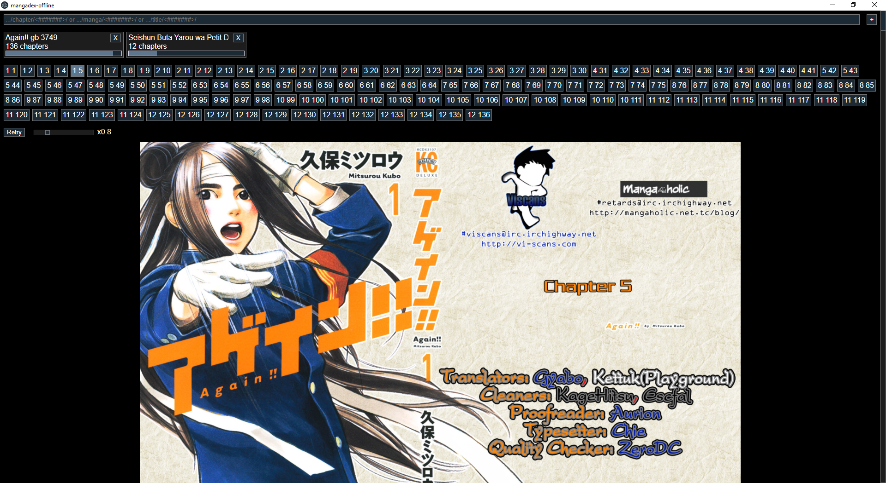

## Mangadex Offline JS

This is a lightweight JS app to download mangas from mangadex for offline reading.

### How to use

#### Downloading mangas

Input a manga URL into the text input and press enter or click the `+` button. A manga-box should appear below specifying the manga's title, # of chapters, and fetch/download progressbar. 

URLs should be of one of the following formats:

- https://mangadex.org/title/<#######>
- https://mangadex.org/manga/<#######>
- https://mangadex.org/chapter/<#######>
 
The first 2 formats will download the english chapters. The last format will download in whichever language the provided chapter is in.

#### Reading mangas

Select the desired manga; it's chapters will be displayed below. 

Select the desired chapter; it's pages will be displayed below.

Red placeholder images will display for pages that haven't yet downloaded. This is to let you know there's a page pending so you don't accidentally skip it.

The retry button will fetch and download a fresh copy of a chapter. This is useful if a previous download was interrupted leading to incomplete pages.

There's also a zoom slider at the top of each chapter and a 'next' button at the end of each chapter. Ctrl + wheel will also adjust the zoom. 
